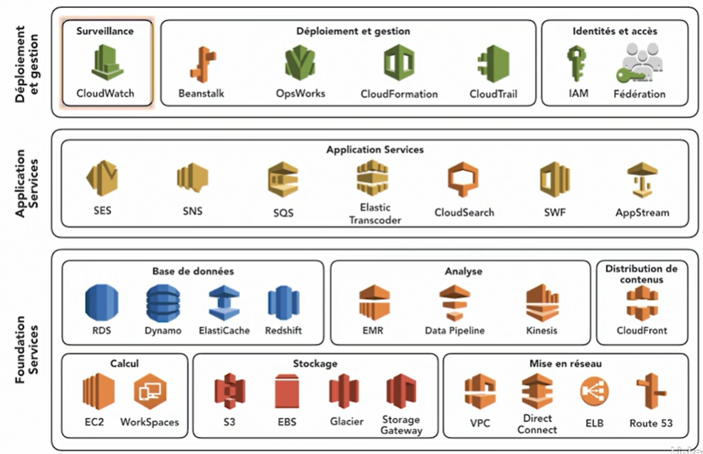
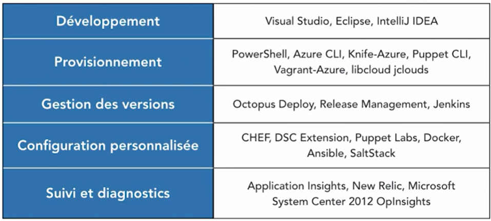
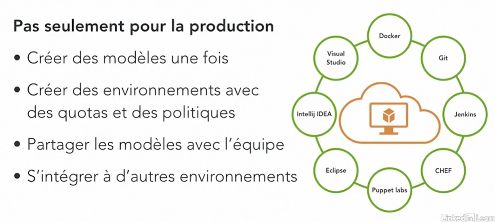
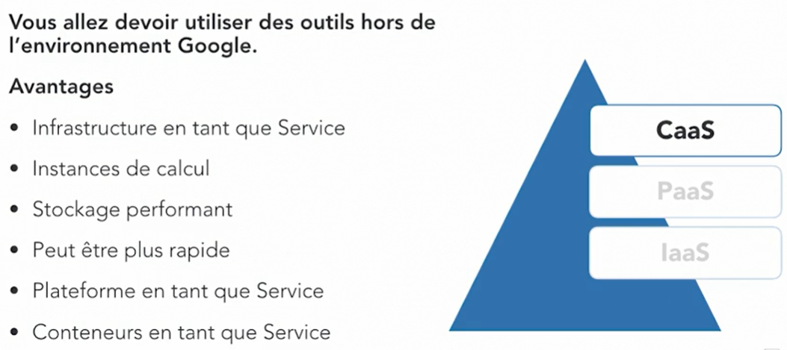
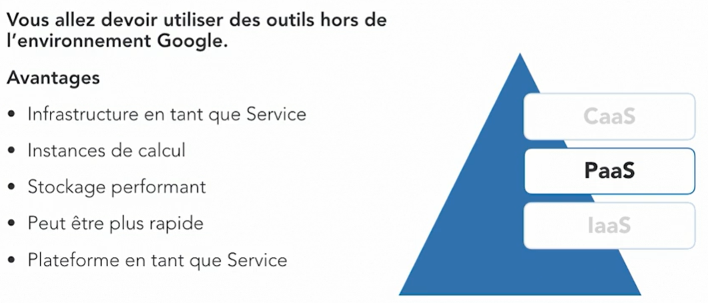
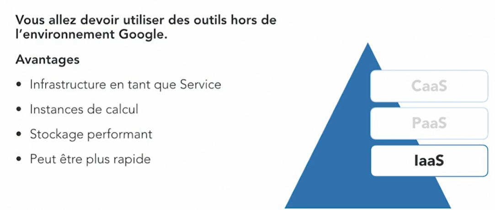
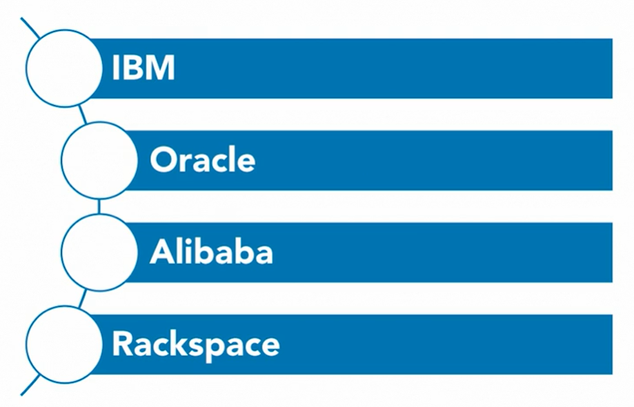
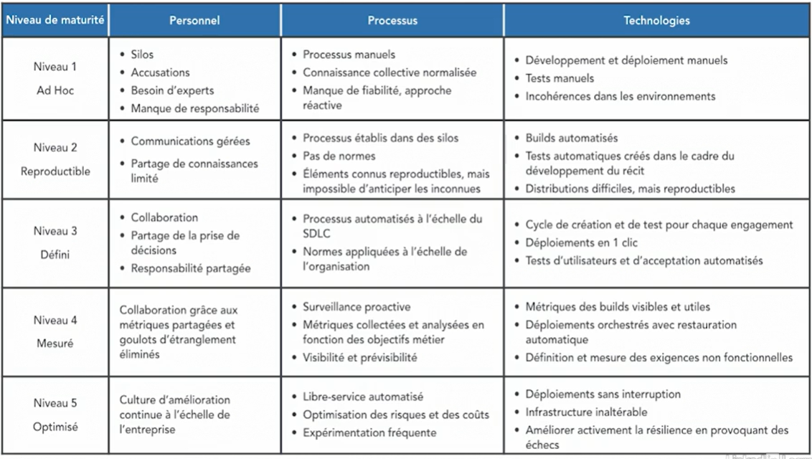
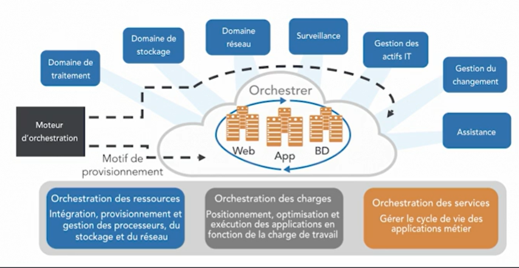

# Découvrir le cloud computing : Le cloud et DevOps

Utilisez DevOps dans le cloud pour gagner en agilité sur le développement logiciel et les opérations. Cette formation vous montre comment mettre en place un processus DevOps cloud et comment exploiter les services proposés par Amazon, Microsoft et Google. David Linthicum, expert du cloud, vous présente d'abord un argumentaire en faveur du DevOps dans le cloud, en citant par exemple la distribution, les tests, l'intégration et le déploiement continus et évolutifs, et ce, quelle que soit la taille de votre organisation. Il vous montrera ensuite comment mettre en place un processus DevOps dans le cloud et vous présentera les solutions DevOps proposées par Amazon Web Services, Microsoft Azure et Google Cloud Platform. Vous découvrirez également des cas d'utilisation et des exemples concrets de services DevOps dans le cloud.
## Découvrir les services DevOps cloud
### Les Outils Cloud DevOps d'AWS

### Les Outils Cloud DevOps de Microsoft
#### Différents processus et outils

#### Azure DevOps/Test Lab

### Les Outils Cloud DevOps de Google
#### Services CaaS

#### Services PaaS

#### Services IaaS

### Autres Outils Cloud DevOps

## Les Processus DevOps

## Les Orchestrations des Processus DevOps

